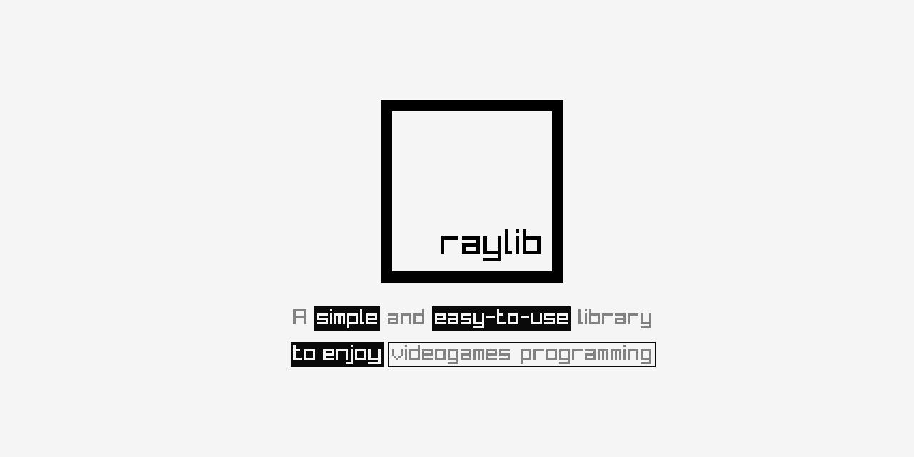

# raylib Guide From Scratch

Esta es una guia desde cero de la librería raylib y c/c++ para creacion de 
videojuegos 2d, 3d, interfaces gráficas, manejo de audio, manejo de imagenes
entre otros objetivos.

El propósito de esta serie es aplicar los conocimientos de aprendidos de raylib
en aplicaciones de uso real, aparte de comprobar y aplicar los ejemplos vistos
en la wiki de la librería. [Raylib Wiki](https://www.raylib.com/examples.html)

**Raylib** es una librería pensada originalmente para el desarrollo espartano de
videojuegos. Palabras de su desarrollador, sin motores de video, aplicaciones de
interfaz gráficas, entre otras cosas. Solo tienes la librería y el lenguaje de
programación para codificar puro y duro; no hay una documentación apropiada para
los nuevos o menos experimentados en el desarrollo de videojuegos, solo tienes 
una hoja con todas las funciones que tiene esta magnifica biblioteca, lo que no
es suficiente para quien no tiene conocimientos previos. 

Al olvidarnos de todas estas cosas que tienden a confundirnos, distraernos, y 
volver mucho más lenta la curva de aprendizaje cuando estamos comenzando en el 
desarrollo de videojuegos o interfaces gráficas; podemos concentrarnos 
totalmente en el desarrollo, optimizar nuestro código, ahorrar espacio en disco
al hacer aplicaciones más ligeras, y dedicarnos puramente a programar.

No te confundas, el hecho de que esta biblioteca no tenga interfaces gráficas o
un Engine de desarrollo bien definido, no quiere decir que no puedas hacer cosas
geniales con ella. Todas las imagenes que veas aquí son proyectos que yo mismo
he realizado aprendiendo a usar y jugando un poco con la librería.

Si eres del tipo de personas que lo quieren todo fácil, te recomiendo que no
continues con esta guia, debido a que no la lo tendrás fácil, sin embargo si 
eres el del tipo de personas que le gusta los retos, y no quieres depender de un
Engine de desarrollo, como ser Unity, Unreal, Godot, Etc; o aplicacion de pago 
para desarrollar tus propios videojuegos o aplicaciones gráficas, pues este es 
tu punto de partida.

A pesar de todas estas cosas raylib se siente muy cómodo y muy ligero a la hora
de codificar, debido a que abstrae muchas de las rutinas y cosas engorrosas y 
nos facilita el desarrollo a nivel de código. 
A mi ver **raylib** y el ver de empresas como **GOOGLE** tiene mucho potencial,
no solo para los videojuegos, sino para todo tipo de propósito. 

Debido a que no hay una documentación establecida hasta el momento, me he tomado
la atribución y la tarea desarrollar esta guia para todos aquellos que como yo,
quieran sacarle el maximo provecho a esta herramienta. 

Te pido me tengas un poco de paciencia porque ire subiendo documentación de poco
a poco, a medida que mi tiempo me lo permita. Sin mas preambulos, comencemos.

## Introducción
[raylib [core]](/CORE.md)
